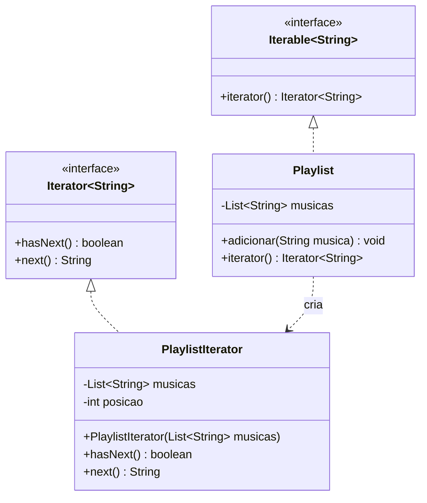

```mermaid
classDiagram
    class Iterable~String~ {
        <<interface>>
        +iterator() Iterator~String~
    }
    class Iterator~String~ {
        <<interface>>
        +hasNext() boolean
        +next() String
    }
    class Playlist {
        -List~String~ musicas
        +adicionar(String musica) void
        +iterator() Iterator~String~
    }
    class PlaylistIterator {
        -List~String~ musicas
        -int posicao
        +PlaylistIterator(List~String~ musicas)
        +hasNext() boolean
        +next() String
    }

    Iterable~String~ <|.. Playlist
    Iterator~String~ <|.. PlaylistIterator
    Playlist ..> PlaylistIterator : cria
```
